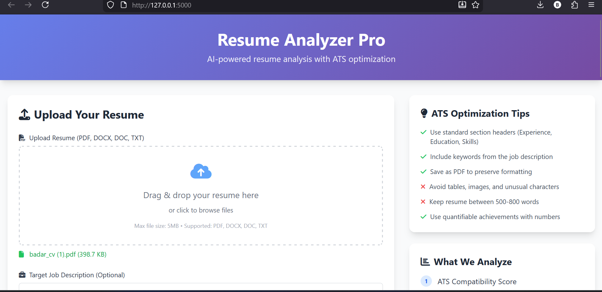
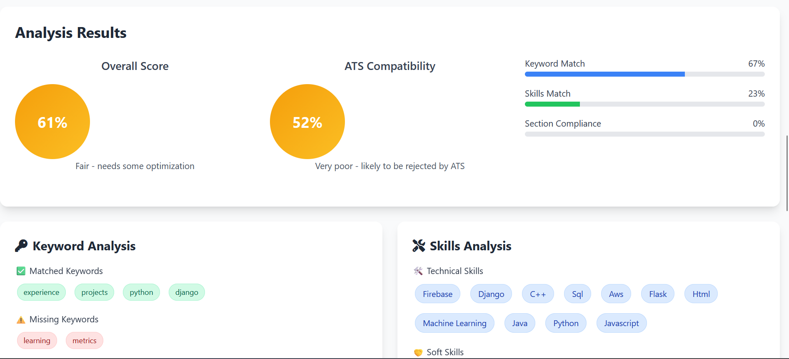

# AI-Powered Resume Analyzer & ATS Scorer




A modern web application that analyzes resumes and provides ATS (Applicant Tracking System) compatibility scores with actionable recommendations.

## Features

- **Resume Upload**: Support for PDF, DOCX, and TXT formats
- **ATS Scoring**: Comprehensive scoring based on keyword matching, format compliance, and section analysis
- **Resume Analysis**: 
  - Word count and readability metrics
  - Skills extraction (technical and soft skills)
  - Quantifiable achievements detection
  - Section validation
- **Smart Recommendations**: AI-powered suggestions to improve resume quality
- **Modern UI**: Responsive design with gradient effects and interactive visualizations

## Technologies Used

- **Backend**: Flask (Python 3.12)
- **NLP**: spaCy, NLTK
- **Document Processing**: PyMuPDF, python-docx
- **Analysis**: scikit-learn, pandas, textstat
- **Frontend**: HTML5, Tailwind CSS, Axios

## Installation

1. Clone the repository:
```bash
git clone <your-repo-url>
cd aiapplication
```

2. Create virtual environment:
```bash
python -m venv env
```

3. Activate virtual environment:
```bash
# Windows
env\Scripts\activate

# Linux/Mac
source env/bin/activate
```

4. Install dependencies:
```bash
pip install flask flask-cors spacy nltk pymupdf python-docx textstat pandas scikit-learn
```

5. Download required models:
```bash
python -m spacy download en_core_web_sm
python -c "import nltk; nltk.download('punkt_tab'); nltk.download('punkt'); nltk.download('stopwords')"
```

## Usage

1. Start the server:
```bash
python app.py
```

2. Open your browser and navigate to:
```
http://localhost:5000
```

3. Upload your resume and optionally provide a job description for better ATS matching

## Project Structure

```
aiapplication/
├── app.py                 # Main Flask application
├── resume_analyzer.py     # Resume analysis logic
├── ats_scorer.py         # ATS scoring engine
├── templates/
│   └── index.html        # Web interface
├── uploads/              # Temporary file storage (auto-created)
└── requirements.txt      # Python dependencies
```

## Scoring Algorithm

The overall score is calculated using weighted metrics:
- ATS Score: 35%
- Keyword Match: 25%
- Skills Match: 15%
- Readability: 10%
- Validation: 15%

## Requirements

- Python 3.12+
- Flask 3.1.2
- spaCy 3.8.11
- NLTK 3.9.2
- PyMuPDF 1.26.7
- python-docx 1.2.0
- textstat 0.7.12
- pandas 2.3.3
- scikit-learn 1.8.0

## License

MIT License

## Author

Created as part of Batch 22 - 2025 AI Application Development
